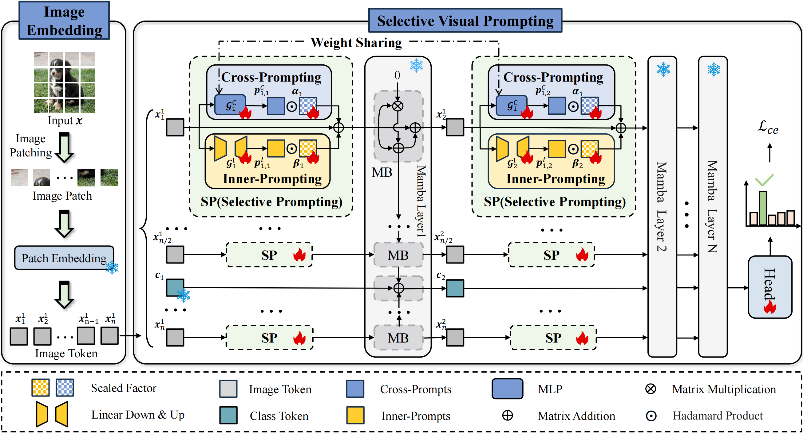

# Selective Visual Prompting in Vision Mamba

<div align="center">

<div>
      Yifeng Yao&emsp; Zichen Liu&emsp; Zhenyu Cui&emsp; Yuxin Peng&emsp; Jiahuan Zhou
  </div>
<div>

  Wangxuan Institute of Computer Technology, Peking University

</div>
</div>
<p align="center">
  <a href='https://arxiv.org/abs/2412.08947'></a>
  <a href="https://hits.seeyoufarm.com"></a>
</p>

Official implementation of "[Selective Visual Prompting in Vision Mamba](https://arxiv.org/abs/2412.08947)"
`
<p align="center"></p>

Pre-trained Vision Mamba (Vim) models have demonstrated exceptional performance across various computer vision tasks in a computationally efficient manner, attributed to their unique design of selective state space models. To further extend their applicability to diverse downstream vision tasks, Vim models can be adapted using the efficient fine-tuning technique known as visual prompting. However, existing visual prompting methods are predominantly tailored for Vision Transformer (ViT)-based models that leverage global attention, neglecting the distinctive sequential token-wise compression and propagation characteristics of Vim. Specifically, existing prompt tokens prefixed to the sequence are insufficient to effectively activate the input and forget gates across the entire sequence, hindering the extraction and propagation of discriminative information. 

To address this limitation, we introduce a novel **Selective Visual Prompting (SVP)** method specifically for the efficient fine-tuning of Vim. To prevent the loss of discriminative information during state space propagation, SVP employs lightweight selective prompters for token-wise prompt generation, ensuring adaptive activation of the update and forget gates within Mamba blocks to promote discriminative information propagation. Moreover, considering that Vim propagates both shared cross-layer information and specific inner-layer information, we further refine SVP with a dual-path structure: Cross-Prompting and Inner-Prompting. Cross-Prompting utilizes shared parameters across layers, while Inner-Prompting employs distinct parameters, promoting the propagation of both shared and specific information, respectively. Extensive experimental results on various large-scale benchmarks demonstrate that our proposed SVP significantly outperforms state-of-the-art methods.
### Environment Setup
1. Python 3.10.13 and requirements

```bash 
conda env create -f environment.yml
```

if you have trouble in this script, you can also create the conda environment and install the requirements.txt:
```bash 
conda create -n <env_name> python=3.10
conda activate <env_name>
pip install -r requirements.txt
```

2. torch 2.1.1 + cu118
```bash 
pip install torch==2.1.1 torchvision==0.16.1 torchaudio==2.1.1 --index-url https://download.pytorch.org/whl/cu118
```
3. Install causal_conv1d and mamba
```bash
pip install -e causal_conv1d>=1.1.0
pip install -e mamba-1p1p1
```
### Dataset Preparation
1. HTA dataset can be downloaded from [DAM_VP](https://github.com/shikiw/DAM-VP/tree/main). The splitted dataset can be found in [VPT](https://github.com/KMnP/vpt).We also provide the download links here.
- [CUB200](https://data.caltech.edu/records/65de6-vp158)
- [NABirds](http://info.allaboutbirds.org/nabirds/)
- [Oxford Flowers](https://www.robots.ox.ac.uk/~vgg/data/flowers/)
- [Stanford Dogs](http://vision.stanford.edu/aditya86/ImageNetDogs/main.html)
- [Stanford Cars](https://ai.stanford.edu/~jkrause/cars/car_dataset.html)
- Other HTA datasets are all avaliable at torchvision and will be automatically downloaded.
2. VTAB dataset can be downloaded from [SSF](https://github.com/dongzelian/SSF).
The dataset folder should be organized as follows:
```bash
│data/
│   ├──FGVC/
│   │   ├──CUB_200_2011/
│   │   ├──OxfordFlower/
│   │   ├──Stanford-cars/
│   │   ├──Stanford-dogs/
│   │   ├──nabirds/
│   ├──VTAB/
│   │   │──vtab-1k/
│   │   │   ├──caltech101
│   │   │   ├──cifar
│   │   │   ├──clever_count
│   │   │   ├──clever_dist
│   │   │   ├──.......
├──.......
```

The file structure should look like:
### Pre-Trained Checkpoints
We incorporated the Vim-small checkpoint as backbones:

- [Vim-small](https://huggingface.co/hustvl/Vim-small-midclstok)

Please download the checkpoint and put it in ./checkpoint/vim-small-midclstok/vim_s_midclstok_80p5acc.pth.

## Run commands
Training script for different experinments are provided in svp/scripts/


## Acknowledgement

This project is mainly based on on [Mamba](https://github.com/state-spaces/mamba), [Causal-Conv1d](https://github.com/Dao-AILab/causal-conv1d), [Vim](https://github.com/hustvl/Vim).

## Citation

If you find this work helpful, please cite:
```
@inproceedings{yao2024svp,
  title={Selective Visual Prompting in Vision Mamba},
  author={Yao, Yifeng and Liu, Zichen and Cui, Zhenyu and Peng, Yuxin and Zhou, Jiahuan},
  booktitle={AAAI},
  year={2025}
}

```